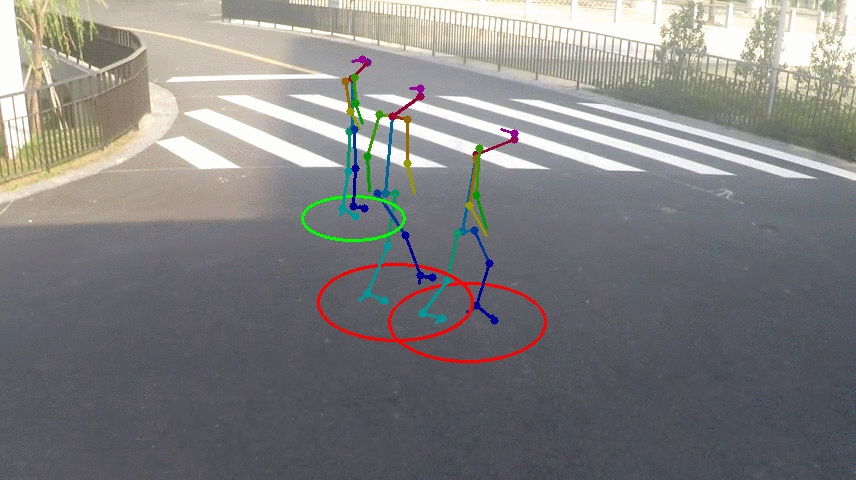

# Social-Distancing
Social-Distancing is an open-source project for automatically estimating interpersonal distance from uncalibrated RGB cameras. The software can be freely used for any non-commercial applications to assess compliance with safe distances. The code is open and can be improved with your support, please contact us at socialdistancing@iit.it if you would like to help us.



## Description
Given a frame captured from a scene, the algorithm first detects visible people in the scene using an off-the-shelf body pose detector and estimates the height of the people through measuring the distance from their body joints. In the second step, the algorithm estimates an area of one meter around all the detected people. This distance is roughly estimated proportional to a typical human body height of 160 cm and can be used to draw a circle centered in human position in the scene. In the third step, the Homography of the scene is estimated given two parameters which essentially map the rectangular bird’s view model for the scene to the trapezoidal perspective view of the scene. These two parameters need to be manually tuned to estimate best the scene perspective. According to the Homography matrix, the safe circular distance for each person is converted to ellipsoids in perspective view. The people are considered to be staying in safe distance from each other if their ellipsoids do not collide. Conversely, if ellipsoids of two people collide, those people are considered as being in risk and their ellipsoids will be shown in red.
 
## Installation steps
Code is developed in Python3 and tested on Ubuntu 18.04 with NVidia driver, Cuda 10.0 and Cudnn 7.6.5. 

* [x] **Install the requirements**  
To run this code, you need to install:

    * **OpenPose**:    
    Please follow the instruction in the repository [gitHub](https://github.com/CMU-Perceptual-Computing-Lab/openpose) and install OpenPose in `social-distancing/openpose/` folder.   
    In case you prefer to use a different OpenPose installation folder, you can pass it using the `--openpose_folder` argument. 
     
    * **OpenCV**:    
        `apt-get install python3-opencv`  
        `pip3 install opencv-python`

## Usage

```
$ python social-distancing.py --image_in <path to the input image> --image_out <path to the result image> --horizontal_ratio 0.7 --vertical_ratio 0.7
```

## Dataset
We tested Social-Distancing code on the public ShanghaiTech'dataset. 

```
@inproceedings{zhang2016single,
  title={Single-image crowd counting via multi-column convolutional neural network},
  author={Zhang, Yingying and Zhou, Desen and Chen, Siqin and Gao, Shenghua and Ma, Yi},
  booktitle={Proceedings of the IEEE conference on computer vision and pattern recognition},
  pages={589--597},
  year={2016}
}
```

## Disclaimer
Information provided by the software is to be intended as an indication of safe distance compliance. It is not intended to measure the actual metric distance among people.

The software is provided "as is", without warranty of any kind, express or implied, including but not limited to the warranties of merchantability, fitness for a particular purpose and noninfringement. In no event shall the authors, PAVIS or IIT be liable for any claim, damages or other liability, whether in an action of contract, tort or otherwise, arising from, out of or in connection with the software or the use or other dealings in the software.

## LICENSE
This project is licensed under the terms of the MIT license.

This project incorporates material from the projects listed below (collectively, "Third Party Code").  This Third Party Code is licensed to you under their original license terms.  We reserves all other rights not expressly granted, whether by implication, estoppel or otherwise.

1. [OpenPose](https://github.com/CMU-Perceptual-Computing-Lab/openpose) 
2. [OpenCV](https://opencv.org)


